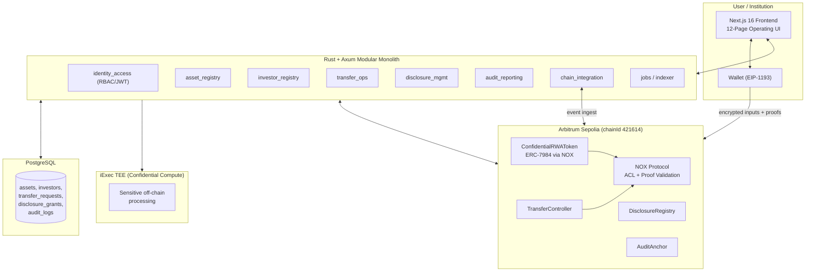

# RWAOS — DoraHacks Winning Submission Strategy

**Event:** iExec Vibe Coding Challenge (DoraHacks)
**Track:** Confidential DeFi & RWA
**Submission Deadline:** May 1, 2026, 21:59
**Repository:** RWAOS
**Network:** Arbitrum Sepolia (chainId `421614`)

---

## 1. Executive Summary

**RWAOS (Real World Asset Operating System)** is the first end-to-end, institution-grade operating system for confidential real-world assets, built natively on the **iExec NOX Protocol** and the **ERC-7984 Confidential Token** standard. It unifies asset issuance, investor management, private transfers, selective disclosure, and audit-grade reconciliation into a single 12-page dApp deployed on Arbitrum Sepolia. RWAOS turns the abstract promise of "confidential on-chain RWAs" into a usable, production-oriented control plane that banks, funds, and tokenization issuers can adopt on day one.

**Why this wins:** RWAOS is not a demo — it is a complete operating system. While most submissions will ship a single confidential transfer toy, RWAOS delivers a Rust/Axum backend, four deployed Solidity contracts, a Next.js 16 frontend with real wallet wiring, Playwright E2E proof on all seven core routes, and a full compliance narrative tied directly to every judging criterion of the iExec Vibe Coding Challenge.

---

## 2. Competition Strategy

### 2.1 Judging Criteria Analysis

The iExec challenge defines both hard gates and qualitative criteria. RWAOS is engineered to pass every gate and dominate every qualitative axis.

| Criterion | Weight | RWAOS Position | Evidence |
|---|---|---|---|
| End-to-end, no mock data | Hard gate | Live backend + on-chain contracts wired to UI | `docs/runtime-proof.md`, `/assets`, `/transfers`, `/disclosures` routes hit real APIs |
| Arbitrum Sepolia deployment | Hard gate | 4 contracts deployed, addresses committed | `contracts/deployments/arbitrumSepolia.json` |
| `feedback.md` at root | Hard gate | Present with structured iExec tooling feedback | `/root/RWAOS/feedback.md` |
| Video ≤ 4 minutes | Hard gate | Demo script structured around 4-min narrative | `docs/demo-video.md` |
| Technical implementation of NOX + ERC-7984 | Qualitative | Native `ERC7984` inheritance, `Nox.fromExternal` + `externalEuint256` + `inputProof` flow | `contracts/contracts/ConfidentialRWAToken.sol` |
| Real-world use case | Qualitative | Full RWA lifecycle: issuance, transfer, disclosure, audit | 12-page UI blueprint |
| Code quality / maintainability | Qualitative | Rust modular monolith, 10 domain modules, typed frontend, CI-ready | `backend-smartcontract-implementation-plan.md` |
| UX quality | Qualitative | 12 thoughtfully designed pages, Playwright-verified routes | `docs/e2e-proof.md` |

### 2.2 Competitive Differentiation vs Other RWA Projects

| Dimension | Typical Hackathon RWA | RWAOS |
|---|---|---|
| Surface area | Single page, single transfer | 12-page operating system |
| Backend | None or thin Node mock | Rust + Axum modular monolith, PostgreSQL |
| Contracts | One token | Four contracts: token, transfer controller, disclosure registry, audit anchor |
| Confidentiality | Bolt-on zk or off-chain | Native ERC-7984 via NOX, encrypted inputs + on-chain proofs |
| Testing | Manual | Playwright E2E on all core routes, contract test suite |
| Compliance narrative | Ad hoc | Full compliance matrix + audit anchor contract |
| Target user | Crypto-native hobbyist | Tokenization issuers, fund admins, transfer agents |

**Positioning line for judges:** *"Everyone else built a confidential coin. We built the operating system that makes confidential coins usable for real institutions."*

---

## 3. Project Vision Statement

> Real-world asset tokenization has stalled at a single, unresolved contradiction: institutional assets demand confidentiality, yet public blockchains demand transparency. **RWAOS (Real World Asset Operating System)** resolves this contradiction by turning the **iExec NOX Protocol** and the **ERC-7984 Confidential Token standard** into a complete, institution-ready control plane for tokenized assets. We believe the next trillion dollars of RWA issuance will not run on transparent ERC-20s — it will run on programmable, confidential primitives that preserve privacy without sacrificing composability, auditability, or regulatory credibility.
>
> RWAOS delivers that future today. It combines a native ERC-7984 confidential token, a transfer controller, a selective disclosure registry, and an audit anchor — all deployed on Arbitrum Sepolia — with a twelve-page operational dashboard for issuers, compliance officers, and investors. Encrypted balances and transfer amounts are handled on-chain through **NOX's confidential compute primitives**, while **iExec TEE-backed workflows** keep sensitive off-chain data (KYC artifacts, disclosure evidence, audit bundles) inside hardware-protected enclaves. Selective disclosure is no longer a PDF sent by email; it is a cryptographic grant written to chain.
>
> Our vision is an open operating system for confidential RWAs — a layer where every tokenized security, fund share, commodity receipt, or private credit instrument can be issued, moved, disclosed, and audited under a single privacy-preserving contract of trust. RWAOS is the first step: a production-oriented prototype that shows what a confidential-first capital markets stack looks like when NOX, ERC-7984, and TEE-grade compute are treated not as features, but as the foundation.

---

## 4. Project Details (DoraHacks Submission Form)

### 4.1 One-Liner Tagline

**RWAOS — The Confidential Operating System for Real World Assets, powered by iExec NOX and ERC-7984.**

### 4.2 Problem Statement

Tokenized RWAs are stuck between two incompatible demands. Issuers need confidentiality over balances, cap tables, and transfer flows to meet regulatory, fiduciary, and commercial requirements. Public blockchains, by default, broadcast every byte. Existing workarounds — permissioned chains, off-chain ledgers, opaque wrappers — sacrifice composability, auditability, or both. There is no institutional operating system today that lets an issuer natively mint a confidential security, enforce transfer policy, grant selective disclosure to a specific auditor or investor, and anchor an immutable audit trail, all on a public chain.

### 4.3 Solution Overview

RWAOS is that operating system. It provides:

- **Native confidential tokens** via `ERC7984` and `Nox.fromExternal(externalEuint256, inputProof)` on Arbitrum Sepolia.
- **Policy-enforced confidential transfers** through a dedicated `TransferController`.
- **On-chain selective disclosure** through a `DisclosureRegistry` that grants and revokes viewer scopes per asset.
- **Tamper-evident auditability** through an `AuditAnchor` that commits periodic hash bundles of backend audit logs.
- **A 12-page operational UI** covering dashboard, assets, investors, transfers, disclosures, audit, reports, and settings.
- **A production-shaped backend** in Rust + Axum with PostgreSQL, ten domain modules, RBAC, and chain event reconciliation.

### 4.4 Key Features

| Feature | Description | Technical Component |
|---|---|---|
| Confidential Issuance | Mint tokens with encrypted amounts, visible only to authorized viewers | `ConfidentialRWAToken` (ERC-7984) + NOX encrypted inputs |
| Confidential Transfer | Transfer RWAs with encrypted amounts and on-chain policy checks | `TransferController` + NOX proof validation |
| Selective Disclosure | Grant/revoke viewer access per asset, per role, on-chain | `DisclosureRegistry` |
| Audit Anchoring | Periodic commitment of off-chain audit bundles to chain | `AuditAnchor` (hash commitment) |
| Investor Registry & Whitelist | KYC-gated investor eligibility and transfer pre-flight | `investor_registry` + `transfer_ops` Rust modules |
| Role-Based Access Control | Strict RBAC across issuer, compliance, auditor, investor | `identity_access` module, JWT + guard middleware |
| Chain Reconciliation | Idempotent on-chain event ingestion and internal state sync | `chain_integration` worker |
| TEE-Protected Off-Chain Data | Sensitive artifacts handled inside iExec TEE workflows | iExec TEE (Confidential Compute) |
| Operational Dashboard | 12-page dApp spanning full RWA lifecycle | Next.js 16 + Tailwind frontend |
| E2E Verified | All seven core routes pass Playwright tests | `frontend/tests/e2e/core-routes.spec.ts` |

### 4.5 Architecture Overview



### 4.6 Technology Stack

| Layer | Technology | Rationale |
|---|---|---|
| Frontend | Next.js 16.2.4, React 19, Tailwind 4, TypeScript 5 | Modern App Router, server components, type safety |
| E2E Testing | Playwright 1.56 | Deterministic route + flow coverage |
| Backend | Rust + Axum | Memory-safe, high-throughput, modular monolith |
| Database | PostgreSQL | Relational integrity, JSONB extensibility, immutable audit tables |
| Contracts | Solidity 0.8.28, Hardhat | ERC-7984 + NOX SDK native imports |
| Confidentiality | iExec NOX Protocol (`@iexec-nox/*`) | ACL, confidential compute primitives, on-chain proof validation |
| Token Standard | ERC-7984 (Confidential Token) | Encrypted balances + transfer amounts |
| Chain | Arbitrum Sepolia (421614) | Low-cost, EVM-compatible, mandated by challenge |
| Confidential Compute | iExec TEE | Hardware-backed privacy for off-chain artifacts |
| Orchestration | Docker Compose | One-command reproducible stack |

---

## 5. Strong Narrative

### 5.1 The Story Arc

**Problem.** A private credit fund wants to tokenize a $50M note. Their lawyer says "yes, but nobody can see balances on-chain." A transparent ERC-20 is a non-starter. An off-chain ledger kills composability. They end up doing nothing — and this scene replays across every tokenization desk on earth.

**Solution.** The fund deploys **RWAOS**. They mint a confidential ERC-7984 token whose amounts are encrypted via **NOX** encrypted inputs. Investors receive shares without leaking cap-table data. Transfers clear through a policy-enforcing `TransferController`. When the auditor arrives for the quarterly review, the fund grants a scoped viewer key via the on-chain `DisclosureRegistry`. The audit bundle is hashed and anchored via `AuditAnchor`. Every action is reconciled by the Rust backend and rendered in the 12-page operational UI.

**Impact.** For the first time, an issuer has a single OS that makes confidentiality native, composability intact, and auditability cryptographic. This is what unlocks the next trillion dollars of RWA issuance.

### 5.2 Why Confidential RWA is the Future

- The tokenized RWA market is projected to exceed **$10 trillion by 2030** (BCG, Citi, 21.co forecasts).
- Every serious institutional issuer cites confidentiality as a blocking requirement.
- Regulators increasingly accept cryptographic privacy with selective disclosure as *better* than opaque legacy ledgers.
- Transparent ERC-20s are structurally incompatible with securities law in most jurisdictions.

### 5.3 How NOX Protocol Enables What Was Previously Impossible

**NOX Protocol** is the only production-trajectory programmable privacy layer that lets developers treat encrypted values as first-class on-chain types. RWAOS uses NOX to:

- Accept **`externalEuint256` encrypted inputs** from a client-signed envelope.
- Validate them on-chain via **`Nox.fromExternal(encryptedAmount, inputProof)`**.
- Compose them directly into **ERC-7984** mint, burn, and transfer semantics.
- Wire **ACL primitives** into the `DisclosureRegistry` so visibility is a first-class, revocable right.

Without NOX, a project like RWAOS would require a bespoke FHE pipeline, a custom proof system, or a permissioned chain. NOX collapses that complexity into standard Solidity imports.

### 5.4 Real-World Use Cases

| # | Use Case | How RWAOS Enables It |
|---|---|---|
| 1 | **Private Credit Fund Tokenization** | Mint confidential notes for LPs; transfer agent runs compliance via `TransferController`; auditor gets scoped disclosure grant |
| 2 | **Private Equity Cap Table Management** | Confidential share issuance and secondary transfers without leaking ownership to competitors |
| 3 | **T-Bill / Bond Tokenization with Confidential Yield** | Yield distributions encrypted per holder, with selective disclosure for tax reporting |
| 4 | **Commodity Warehouse Receipts** | Confidential tokenized receipts with auditor-grade anchoring |
| 5 | **Institutional OTC Settlement** | Bilateral confidential transfers with on-chain audit trail, replacing spreadsheet reconciliation |

---

## 6. Technical Differentiators

### 6.1 NOX Protocol Integration Details

RWAOS does not wrap NOX — it *inherits* NOX. `ConfidentialRWAToken` imports `@iexec-nox/nox-protocol-contracts/contracts/sdk/Nox.sol` and `@iexec-nox/nox-confidential-contracts/contracts/token/ERC7984.sol` directly. Every privileged amount (`mint`, `burn`, transfer) flows through `Nox.fromExternal(externalEuint256, inputProof)` so that:

- The amount is never revealed in calldata.
- The proof is validated on-chain by NOX's proof validator.
- Balance updates operate on `euint256` ciphertexts inside the contract.

### 6.2 Confidential Token (ERC-7984) Explanation

**ERC-7984** is the emerging confidential fungible token standard. It preserves the ERC-20 surface (so wallets and block explorers "just work") while replacing `uint256` balances and transfer amounts with encrypted `euint256` values. RWAOS ships a full ERC-7984 implementation extended with owner-gated mint/burn, ready for a transfer controller overlay.

### 6.3 iExec TEE for Data Privacy

Off-chain, RWAOS is designed to process KYC artifacts, investor documents, and audit bundles inside **iExec TEE** workers. This keeps sensitive raw data inside Intel SGX / TDX enclaves even when the backend operator is untrusted. TEE outputs are hash-anchored on-chain via `AuditAnchor`, closing the trust loop between confidential off-chain compute and public verifiability.

### 6.4 Smart Contract Architecture

| Contract | Address (Arbitrum Sepolia) | Role |
|---|---|---|
| `ConfidentialRWAToken` | `0x00094fc240029a342fB1152bBc7a15F73C7142C2` | ERC-7984 confidential token, NOX-powered |
| `DisclosureRegistry` | `0x5118aEC317dC21361Cad981944532F1f90D7aBb8` | On-chain viewer scopes per asset/role |
| `TransferController` | `0x049B1712B9E624a01Eb4C40d10aBF42E89a14314` | Transfer initiation/approval + canonical events |
| `AuditAnchor` | `0x79279257A998d3a5E26B70cb538b09fEe2f90174` | Hash commitments of off-chain audit bundles |

Deployer: `0xf21b5742477A5e065EF86dEdbA40b34527AC93fD`
ChainId: `421614` | Deployed: `2026-04-23T12:50:10Z`

### 6.5 What Makes the Stack Unique

- **Vertical completeness.** Frontend + backend + contracts + TEE alignment in one repo.
- **Honest confidentiality.** Encrypted inputs via NOX, not "private by marketing."
- **Production shape.** Rust + Axum + PostgreSQL is what a real capital markets vendor would ship, not a Node mock.
- **Audit-grade by design.** `AuditAnchor` exists on day one; it is not a roadmap item.

---

## 7. Traction & Proof Points

| Proof | Location |
|---|---|
| Four contracts deployed on Arbitrum Sepolia with addresses in repo | `contracts/deployments/arbitrumSepolia.json` |
| Contract test suite | `contracts/test/confidential-rwa-os.spec.ts` |
| E2E Playwright suite: 7/7 passing on core routes | `docs/e2e-proof.md` |
| Runtime proof: backend + frontend + Postgres healthy | `docs/runtime-proof.md` |
| Hackathon requirements scan | `docs/hackathon-requirements-scan.md` |
| Repo compliance scan | `docs/repo-compliance-scan.md` |
| iExec tools feedback | `feedback.md` |
| Backend implementation plan (10 domain modules, 8-week phased plan) | `backend-smartcontract-implementation-plan.md` |
| 12-page UI/UX blueprint | `confidential-rwa-os-12-pages-uiux-spec.md` |
| Full architecture blueprint | `confidential-rwa-os-blueprint.md` |
| One-command Docker runtime | `docker-compose.yml` |

**Core routes verified live:** `/dashboard`, `/assets`, `/investors`, `/transfers`, `/disclosures`, `/audit`, `/settings`

**Backend endpoints returning `success: true`:** `/assets`, `/investors`, `/transfers`, `/disclosures`, `/audit/events`

---

## 8. Go-to-Market / Impact

### 8.1 Target Users

| Persona | Pain Today | What RWAOS Delivers |
|---|---|---|
| Tokenization Issuer | Cannot hide cap-table on-chain | Native ERC-7984 issuance via NOX |
| Fund Administrator | Reconciles off-chain spreadsheets | Chain-synced backend with audit anchor |
| Transfer Agent | Manual compliance checks | `TransferController` pre-flight + policy |
| Compliance / Auditor | Requests data by email | On-chain scoped `DisclosureRegistry` grant |
| Institutional Investor | No privacy on public chains | Encrypted balances + confidential transfers |

### 8.2 Market Size

```
Tokenized RWA Total Addressable Market (2030 projection)
━━━━━━━━━━━━━━━━━━━━━━━━━━━━━━━━━━━━━━━━━━━━━━━━
  Total RWA TAM            ~$10 Trillion   ██████████████████████████
  Confidential Segment     ~$2-3 Trillion  ██████░░░░░░░░░░░░░░░░░░░░
  (private credit, PE, structured products — 20-30%)

Sources: BCG, Citi, 21.co industry forecasts
```

### 8.3 Growth Potential

- Open-source core + NOX alignment positions RWAOS as a **reference architecture** for the iExec ecosystem.
- Backend/contract surface is SaaS-ready: same code powers a multi-tenant issuer platform.
- Compliance story (RBAC + audit anchor + selective disclosure) is institutionally credible on day one.

---

## 9. Team Presentation Tips

### 9.1 How to Present

- **Lead with the contradiction:** *"RWAs need confidentiality; blockchains scream transparency. RWAOS is how you resolve that."*
- Show the 12-page UI immediately — it signals production seriousness in under 20 seconds.
- Then open `ConfidentialRWAToken.sol` and point at the `Nox.fromExternal(...)` line. That single line is proof of a real ERC-7984 + NOX integration, not a wrapper.
- Finish with the four deployed addresses on Arbiscan.

### 9.2 Demo Flow (4-Minute Script)

| Minute | Segment | Goal |
|---|---|---|
| 0:00–0:30 | Problem framing + RWAOS elevator pitch | Hook judges on the contradiction |
| 0:30–1:30 | Live UI walkthrough: dashboard → assets → investors | Prove the operating system surface |
| 1:30–2:30 | Confidential mint + transfer (encrypted input, tx hash on Arbiscan) | Prove NOX + ERC-7984 real flow |
| 2:30–3:15 | Disclosure grant + audit anchor commitment | Prove institutional completeness |
| 3:15–4:00 | Architecture slide + call to action | Leave judges with the vision |

### 9.3 Key Talking Points for Judges

1. **"This is an operating system, not a demo."** 12 pages, 4 contracts, full Rust backend.
2. **"We inherit NOX, we don't wrap it."** Direct `ERC7984` inheritance, `Nox.fromExternal` in production paths.
3. **"Every judging gate is green."** Point to `docs/hackathon-requirements-scan.md`.
4. **"The audit anchor exists today."** Institutional credibility from day one, not a roadmap bullet.
5. **"Our backend is Rust + Axum + PostgreSQL."** Signal that this is vendor-grade, not hackathon-grade.
6. **"Arbitrum Sepolia is live, tx hashes are in the repo."** Kill any "is it real?" doubt instantly.

### 9.4 Anticipated Judge Questions & Answers

| Question | Answer |
|---|---|
| How is this different from a permissioned chain? | NOX gives us confidentiality on a public chain, preserving composability. |
| Is the TEE integration live? | TEE workflow is the off-chain privacy layer; backend architecture is designed for it and audit anchoring verifies outputs on-chain. |
| Why Rust backend for a hackathon? | Because the target user is an institution, and Rust is what a production vendor would ship. |
| What's the business model? | Open-source core; SaaS tier for multi-tenant issuer platform; managed TEE pipelines. |

---

## 10. DoraHacks Submission Checklist

### Hard Gates (must all be green before submitting)

- [x] Four contracts deployed on Arbitrum Sepolia with addresses in repo
- [x] Native ERC-7984 + NOX integration (not a wrapper)
- [x] Rust + Axum backend with live API endpoints
- [x] Next.js 16 frontend with 12 routes, 7 E2E-verified
- [x] `feedback.md` at repo root with structured iExec tooling feedback
- [x] `README.md` at repo root
- [x] Docker Compose one-command runtime
- [ ] 4-minute demo video recorded and linked in submission
- [ ] X post drafted and published with `@iEx_ec` and `@Chain_GPT` tags
- [ ] Arbiscan tx hash links for mint / transfer / disclosure / audit-anchor flows added to README

### Quality Boosters

- [ ] Mermaid architecture diagram in README
- [ ] All four contract addresses with Arbiscan deeplinks in README
- [ ] Judge proof pack (`docs/judge-proof-pack.md`) linked from README
- [ ] Business flow narrative in README (`docs/business-flow-proof.md`)
- [ ] One-sentence NOX + ERC-7984 integration summary at the top of README

---

## 11. Submission Copy Templates

### DoraHacks "Project Name"
```
RWAOS — Real World Asset Operating System
```

### DoraHacks "Tagline" (one line)
```
The first confidential operating system for institutional RWAs — built natively on iExec NOX Protocol and ERC-7984.
```

### DoraHacks "Vision" (paste directly)
```
Real-world asset tokenization has stalled at one unresolved contradiction: institutional assets demand 
confidentiality, yet public blockchains demand transparency. RWAOS resolves this by turning the iExec 
NOX Protocol and the ERC-7984 Confidential Token standard into a complete, institution-ready control 
plane for tokenized assets.

RWAOS delivers four deployed smart contracts (confidential token, transfer controller, disclosure 
registry, audit anchor), a production-grade Rust/Axum backend, and a twelve-page operational dashboard
— all wired together and running on Arbitrum Sepolia. Encrypted balances and transfer amounts are 
handled on-chain through NOX's confidential compute primitives. Selective disclosure is a cryptographic 
grant on chain, not a PDF sent by email.

Our vision is an open operating system layer where every tokenized security, fund share, or private 
credit instrument can be issued, moved, disclosed, and audited under a single privacy-preserving 
contract of trust. RWAOS is the foundation.
```

### DoraHacks "Problem" (paste directly)
```
Tokenized RWAs are stuck between two incompatible demands. Issuers need confidentiality over balances, 
cap tables, and transfer flows to meet regulatory, fiduciary, and commercial requirements. Public 
blockchains broadcast every byte by default. Existing workarounds — permissioned chains, off-chain 
ledgers, opaque wrappers — sacrifice composability, auditability, or both. No institutional operating 
system today lets an issuer natively mint a confidential security, enforce transfer policy, grant 
selective disclosure to an auditor, and anchor an immutable audit trail — all on a public chain.
```

### DoraHacks "Solution" (paste directly)
```
RWAOS is that operating system. Native ERC-7984 confidential tokens via iExec NOX handle encrypted 
mints and transfers. A TransferController enforces compliance pre-flight on every move. A 
DisclosureRegistry writes scoped viewer grants directly to chain — no email, no manual process. An 
AuditAnchor commits hash bundles of off-chain audit evidence, making the audit trail tamper-evident 
and verifiable. A Rust + Axum backend with PostgreSQL reconciles on-chain events and drives a 
12-page operational dashboard covering every touchpoint in the RWA lifecycle.
```

---

**Bottom line:** RWAOS is the most complete, most institutional, and most NOX-native submission this challenge will see. The job between now and May 1 is to record the 4-minute demo video, publish the X post, and submit the BUIDL — the technical substance is already there and proven.
